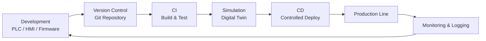
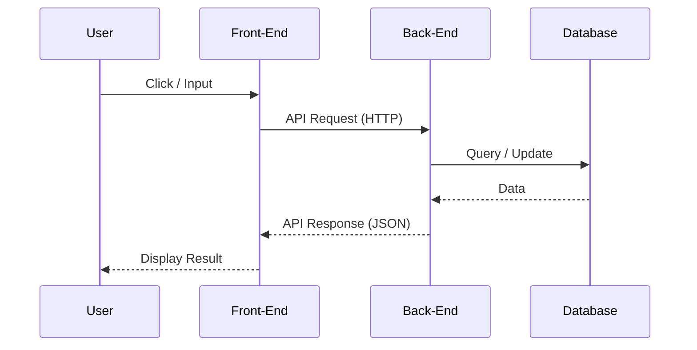

## 🌏 ND2 Learning journey 2025

## 1. DevOps Concepts for Automation Systems

#### 1.1 DevOps คืออะไร (ในบริบท Automation)

**DevOps** คือแนวคิดที่ผสานการทำงานระหว่าง  

- **Development (Dev)**: การพัฒนาโปรแกรม
- **Operations (Ops)**: การติดตั้ง ดูแล และเดินระบบ

ในระบบ Automation:

- Dev → PLC Program, HMI, SCADA, Firmware, Script
- Ops → เดินเครื่อง, Maintenance, Troubleshooting, Production Support

เป้าหมายคือ:

- ลด Downtime
- เพิ่มความเสถียร
- เปลี่ยนแปลงระบบได้เร็วและปลอดภัย

---

#### 1.2 ภาพรวม DevOps Lifecycle สำหรับ Automation

## 2. Front-End & Back-End

#### 2.1 ภาพรวมของระบบ Software

ระบบ Software ส่วนใหญ่แบ่งออกเป็น 2 ส่วนหลัก:

- **Front-End**: ส่วนที่ผู้ใช้มองเห็นและโต้ตอบ
- **Back-End**: ส่วนที่ทำงานเบื้องหลัง

ทั้งสองส่วนสื่อสารกันผ่าน **API**

---

#### 2.2 Front-End คืออะไร

**Front-End** คือส่วนที่ทำงานฝั่งผู้ใช้ (Client Side)

### หน้าที่หลัก

- แสดงผลหน้าจอ (UI)
- รับ Input จากผู้ใช้
- ส่งข้อมูลไปยัง Back-End
- แสดงผลลัพธ์ที่ได้จาก Back-End

### ตัวอย่าง

- Website
- Mobile App
- Desktop App
- HMI / Dashboard

### เทคโนโลยีที่ใช้

- HTML
- CSS
- JavaScript
- Framework: React, Vue, Angular
- Mobile: Flutter, React Native

---

#### 2.3 Back-End คืออะไร

**Back-End** คือส่วนที่ทำงานฝั่ง Server

### หน้าที่หลัก

- ประมวลผล Logic
- จัดการฐานข้อมูล
- Authentication / Authorization
- ติดต่อระบบอื่น

### เทคโนโลยีที่ใช้

- Programming Language: Python, Java, Node.js, Go
- Framework: Django, Spring, Express
- Database: MySQL, PostgreSQL, MongoDB
- API: REST, GraphQL

---

#### 2.4 การสื่อสารระหว่าง Front-End และ Back-End

## 3. Data Processing and AI

#### 3.1 Data Processing คืออะไร?

**Data Processing** คือกระบวนการเปลี่ยน **"ข้อมูลดิบ" (Raw Data)** ที่ยังใช้งานไม่ได้ ให้กลายเป็น **"สารสนเทศ" (Information)** ที่มีประโยชน์ โดยมีขั้นตอนหลักดังนี้:

- **Data Collection:** การรวบรวมข้อมูลจากแหล่งต่างๆ (เช่น เซนเซอร์, เว็บไซต์, ยอดขาย)

- **Data Preparation (Preprocessing):** การทำความสะอาดข้อมูล (Data Cleaning) เพื่อลบข้อมูลที่ผิดพลาดหรือซ้ำซ้อน

- **Data Input:** การนำข้อมูลเข้าสู่ระบบเพื่อเริ่มการประมวลผล

- **Processing:** การคำนวณ จัดหมวดหมู่ หรือวิเคราะห์ตามความต้องการ

- **Data Output:** การแสดงผลในรูปแบบที่เข้าใจง่าย เช่น กราฟ สถิติ หรือรายงาน

---

#### 3.2 Artificial Intelligence (AI) คืออะไร?

**AI** คือเทคโนโลยีที่สร้างความฉลาดให้กับคอมพิวเตอร์ เพื่อให้มันสามารถตัดสินใจหรือทำงานได้เหมือนมนุษย์ โดยอาศัยการเรียนรู้จากรูปแบบ (Patterns) ที่ซ่อนอยู่ในข้อมูล

> **Key Concept:** AI ไม่ได้ถูกเขียนคำสั่งแบบตายตัว (If-Then) แต่เรียนรู้ด้วยตนเองผ่านกระบวนการที่เรียกว่า **Machine Learning (ML)**

---

#### 3.3 ความสัมพันธ์: เมื่อ Data เจอ AI

ในกระบวนการสร้าง AI นั้น การประมวลผลข้อมูลไม่ใช่แค่เรื่องของการทำสรุปผล แต่คือการเตรียม "บทเรียน" ให้คอมพิวเตอร์

1. **Feeding the Machine:** เรานำข้อมูลที่ผ่านการ *Process* จนสะอาดแล้วป้อนเข้าไปในโมเดล AI

2. **Learning Phase:** AI จะใช้ขั้นตอนวิธีทางคณิตศาสตร์เพื่อหาความสัมพันธ์ในข้อมูลนั้นๆ

3. **Inference:** เมื่อ AI เรียนรู้เสร็จ มันจะสามารถรับข้อมูลใหม่ (New Data) และทำการพยากรณ์ผลลัพธ์ได้แม่นยำ

## 4. Deployment & Automation Workflow

    ในโลกของการพัฒนาซอฟต์แวร์สมัยใหม่ **Deployment & Automation Workflow** เปรียบเสมือน "สายพานการผลิตอัตโนมัติ" ที่ช่วยส่งมอบซอฟต์แวร์จากเครื่องของนักพัฒนาไปถึงมือผู้ใช้ได้อย่างรวดเร็ว แม่นยำ และมีมาตรฐาน

---

#### 4.1 หัวใจหลัก: CI/CD Pipeline

กระบวนการอัตโนมัติส่วนใหญ่ถูกขับเคลื่อนด้วยแนวคิด **CI/CD** เพื่อลดภาระงานที่ต้องทำซ้ำๆ (Manual Tasks):

#### **CI (Continuous Integration) - การรวบรวมและทดสอบ**

- **เป้าหมาย:** เพื่อให้แน่ใจว่าโค้ดจากหลายคนรวมกันแล้วไม่พัง

- **กระบวนการ:** เมื่อมีการ Push Code ระบบจะทำการ **Build** (สร้างตัวโปรแกรม) และ **Test** (รันชุดทดสอบอัตโนมัติ) ทันที

#### **CD (Continuous Delivery / Deployment) - การส่งมอบและติดตั้ง**

- **Continuous Delivery:** ระบบเตรียมตัวซอฟต์แวร์ให้พร้อมใช้งานจริง แต่รอการอนุมัติ (Manual Approve) ก่อนปล่อย

- **Continuous Deployment:** ระบบนำซอฟต์แวร์ตัวใหม่ไปติดตั้งบนเซิร์ฟเวอร์จริง (Production) ทันทีที่ผ่านการทดสอบ

---

#### 4.2 ขั้นตอนของ Workflow แบบมาตรฐาน

| **ขั้นตอน (Step)**      | **กิจกรรมที่เกิดขึ้น (Activity)**                  | **เครื่องมือที่นิยมใช้ (Tools)** |
| ----------------------- | -------------------------------------------------- | -------------------------------- |
| **1. Source Control**   | จัดเก็บและจัดการเวอร์ชันของโค้ด                    | GitHub, GitLab, Bitbucket        |
| **2. Build**            | แปลงโค้ดเป็นไฟล์ที่พร้อมรัน หรือสร้าง Docker Image | Docker, Maven, Gradle            |
| **3. Automated Test**   | ตรวจสอบความถูกต้องของโค้ดและช่องโหว่               | Jest, PyTest, SonarQube          |
| **4. Artifact Storage** | จัดเก็บไฟล์เวอร์ชันที่ผ่านการทดสอบแล้ว             | Docker Hub, AWS ECR              |
| **5. Deployment**       | นำไฟล์ไปติดตั้งบน Server หรือ Cloud                | Kubernetes, Terraform, Jenkins   |
| **6. Monitoring**       | เฝ้าระวังประสิทธิภาพและข้อผิดพลาดหลังใช้งาน        | Prometheus, Grafana, ELK         |

---

#### 4.3 ทำไมต้องใช้ Automation?

1. **Speed:** ส่งฟีเจอร์ใหม่ๆ ถึงมือลูกค้าได้ในระดับนาที แทนที่จะเป็นระดับวัน

2. **Reliability:** ลดความผิดพลาดจากคน (Human Error) เพราะทุกอย่างทำงานตามสคริปต์ที่กำหนดไว้

3. **Scalability:** สามารถขยายการติดตั้งไปยังเซิร์ฟเวอร์หลายร้อยตัวได้พร้อมกัน

4. **Consistency:** ทุกสภาพแวดล้อม (Dev, Staging, Prod) จะมีมาตรฐานเดียวกัน

---

#### 4.4 ส่วนเสริมสำหรับสาย AI: MLOps Workflow

หากเป็นงานด้าน **AI/Machine Learning** จะมีขั้นตอนเพิ่มเติมเพื่อจัดการกับ "ข้อมูล" และ "โมเดล" ดังนี้:

- **Data Validation:** ตรวจสอบคุณภาพข้อมูลก่อนนำไปเทรน

- **Automated Training:** ฝึกฝนโมเดลใหม่โดยอัตโนมัติเมื่อมีข้อมูลใหม่เข้ามา

- **Model Registry:** จัดเก็บและระบุเวอร์ชันของ Model AI

- **Model Monitoring:** คอยตรวจสอบว่า AI ทำนายแม่นยำน้อยลงหรือไม่เมื่อเวลาผ่านไป (Data Drift)

---

#### 4.5 บทสรุปความแตกต่าง

> **แบบดั้งเดิม (Manual):** เหมือน "การทำอาหารตามสั่ง" ที่ต้องทำเองทุกขั้นตอน เสี่ยงต่อความผิดพลาดและช้า
> 
> **แบบอัตโนมัติ (Automation):** เหมือน "โรงงานผลิตอาหาร" ที่ทุกอย่างถูกควบคุมด้วยระบบ มีมาตรฐาน และผลิตได้จำนวนมากอย่างรวดเร็ว

## 5. Future Works/Projects

### Energy Management Optimization (ระบบจัดการพลังงานอัจฉริยะ)

**แนวคิด:** ใช้ AI ควบคุมการใช้ไฟฟ้าและทรัพยากรในโรงงานให้คุ้มค่าที่สุด

- **การทำงาน:** AI จะเรียนรู้พฤติกรรมการใช้ไฟของเครื่องจักรและระบบปรับอากาศ จากนั้นจะปรับการทำงานอัตโนมัติ เช่น ลดการใช้ไฟในเครื่องจักรบางตัวในช่วงที่ค่าไฟแพง (Peak) หรือปรับอุณหภูมิห้องตามจำนวนคนและสภาพอากาศข้างนอก

- **เทคโนโลยี:** Smart Meters, Reinforcement Learning

- **ประโยชน์:** ลดค่าไฟ 10-20% และช่วยให้โรงงานก้าวไปสู่การเป็น Green Industry (โรงงานสีเขียว)
