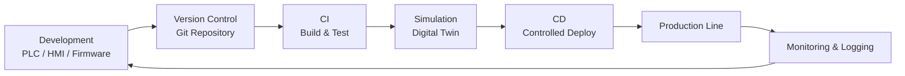

## 🌏 ND2 Learning journey 2025

## 1. DevOps Concepts for Automation Systems

### 1.1 DevOps คืออะไร (ในบริบท Automation)

**DevOps** คือแนวคิดที่ผสานการทำงานระหว่าง  

- **Development (Dev)**: การพัฒนาโปรแกรม
- **Operations (Ops)**: การติดตั้ง ดูแล และเดินระบบ

ในระบบ Automation:

- Dev → PLC Program, HMI, SCADA, Firmware, Script
- Ops → เดินเครื่อง, Maintenance, Troubleshooting, Production Support

เป้าหมายคือ:

- ลด Downtime
- เพิ่มความเสถียร
- เปลี่ยนแปลงระบบได้เร็วและปลอดภัย

---

### 1.2 ภาพรวม DevOps Lifecycle สำหรับ Automation

## 2. Front-End & Back-End

## 3. Data Processing and AI

## 4. Deployment & Automation Workflow

## 5. Future Works/Projects
