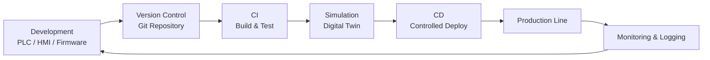
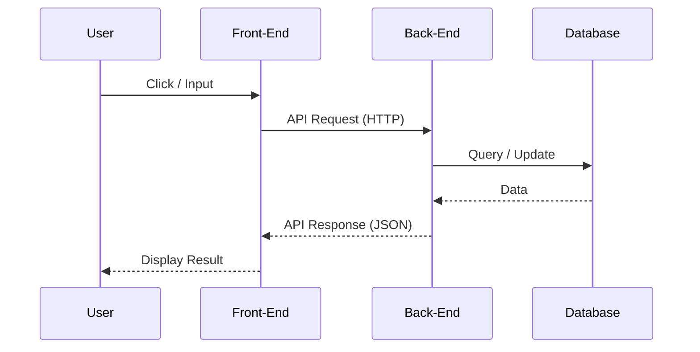

## 🌏 ND2 Learning journey 2025

## 1. DevOps Concepts for Automation Systems

#### 1.1 DevOps คืออะไร (ในบริบท Automation)

**DevOps** คือแนวคิดที่ผสานการทำงานระหว่าง  

- **Development (Dev)**: การพัฒนาโปรแกรม
- **Operations (Ops)**: การติดตั้ง ดูแล และเดินระบบ

ในระบบ Automation:

- Dev → PLC Program, HMI, SCADA, Firmware, Script
- Ops → เดินเครื่อง, Maintenance, Troubleshooting, Production Support

เป้าหมายคือ:

- ลด Downtime
- เพิ่มความเสถียร
- เปลี่ยนแปลงระบบได้เร็วและปลอดภัย

---

#### 1.2 ภาพรวม DevOps Lifecycle สำหรับ Automation

## 2. Front-End & Back-End

#### 2.1 ภาพรวมของระบบ Software

ระบบ Software ส่วนใหญ่แบ่งออกเป็น 2 ส่วนหลัก:

- **Front-End**: ส่วนที่ผู้ใช้มองเห็นและโต้ตอบ
- **Back-End**: ส่วนที่ทำงานเบื้องหลัง

ทั้งสองส่วนสื่อสารกันผ่าน **API**

---

#### 2.2 Front-End คืออะไร

**Front-End** คือส่วนที่ทำงานฝั่งผู้ใช้ (Client Side)

### หน้าที่หลัก

- แสดงผลหน้าจอ (UI)
- รับ Input จากผู้ใช้
- ส่งข้อมูลไปยัง Back-End
- แสดงผลลัพธ์ที่ได้จาก Back-End

### ตัวอย่าง

- Website
- Mobile App
- Desktop App
- HMI / Dashboard

### เทคโนโลยีที่ใช้

- HTML
- CSS
- JavaScript
- Framework: React, Vue, Angular
- Mobile: Flutter, React Native

---

#### 2.3 Back-End คืออะไร

**Back-End** คือส่วนที่ทำงานฝั่ง Server

### หน้าที่หลัก

- ประมวลผล Logic
- จัดการฐานข้อมูล
- Authentication / Authorization
- ติดต่อระบบอื่น

### เทคโนโลยีที่ใช้

- Programming Language: Python, Java, Node.js, Go
- Framework: Django, Spring, Express
- Database: MySQL, PostgreSQL, MongoDB
- API: REST, GraphQL

---

#### 2.4 การสื่อสารระหว่าง Front-End และ Back-End

## 3. Data Processing and AI

## 4. Deployment & Automation Workflow

## 5. Future Works/Projects
